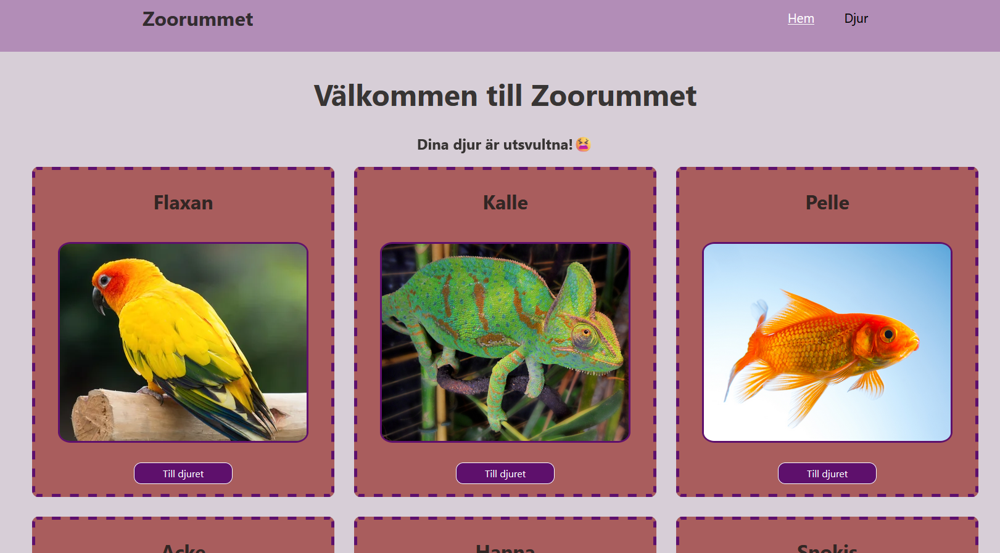
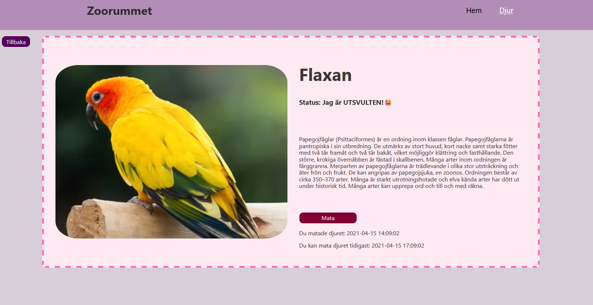
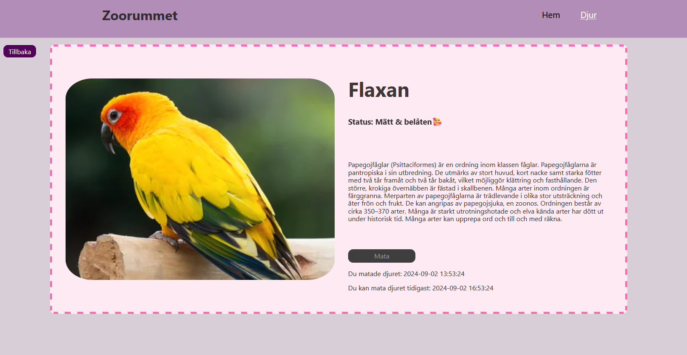
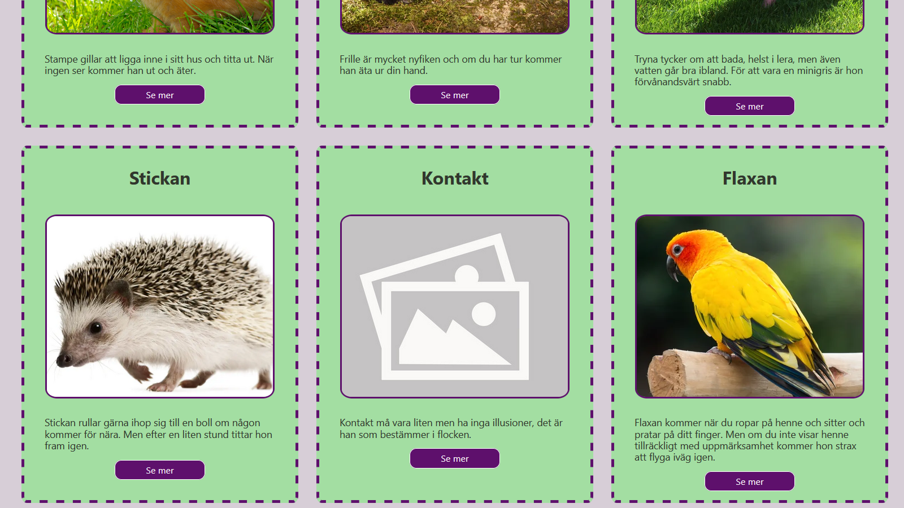
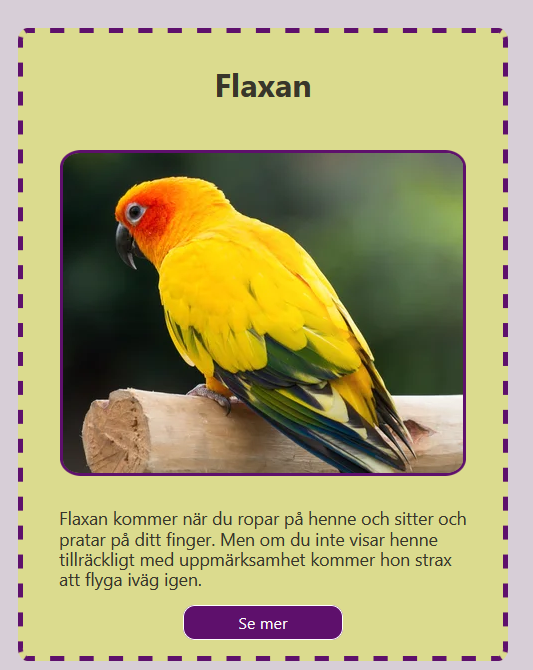
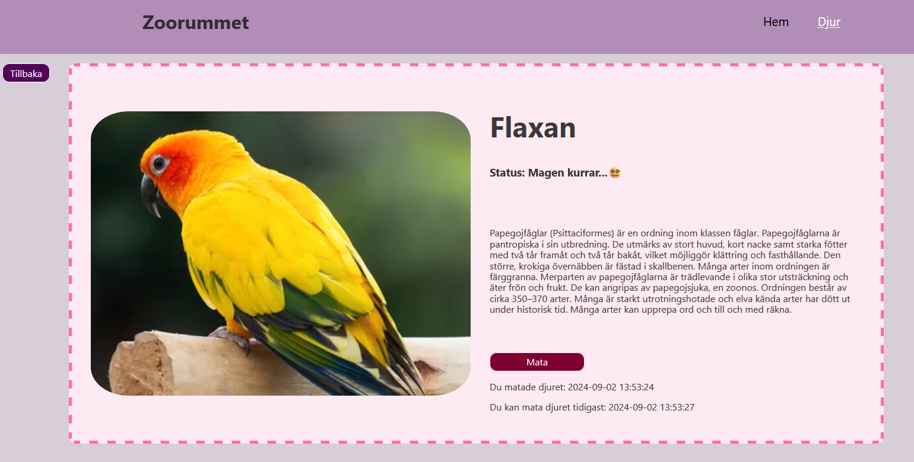
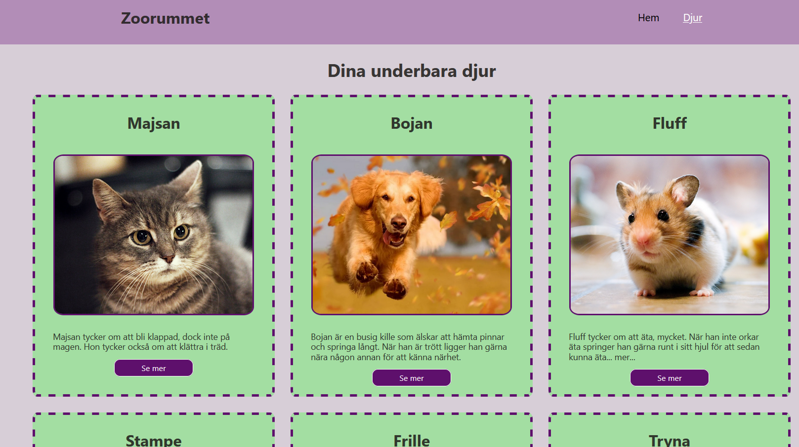
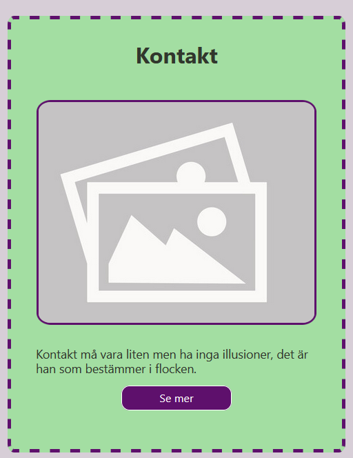

# Assignment - the Zoo
Course: JavaScript - Advanced

## SCREENSHOTS
 
 Home page. Only the most hungry animals (more then 4 hours since fed) is displaying here.

 The animal page. Here you can feed the starving/hungry animal. 

  When it's fed, button goes disabled. 

 On the animals page, the card turns green when it's fed and happy.

  On the animals page, the card turns yellow when it's hungry. 

  When it's hungry, status updates and button is enabled again. 

  Animals page.

  If an image is missing or broken, a placeholder image displays.

## Built with:
- Semantic HTML5 markup
- CSS/SASS
- Flexbox
- React
- React Router
- TypeScript
- Vite
- ESLint 

## Start the project
>npm i 
 npm run dev

### ABOUT THIS PROJECT
In this assignment, the task was to create a Single Page Application (SPA) using React with TypeScript that includes the following features:
- A home page where animals are presented with their names and a short description.
- Each animal should be clickable, leading to a dedicated route that displays more detailed information about that specific animal.
- On the animal's detail page, you should be able to mark the animal as fed through a button labeled "Feed Animal." When you click this button, the animal's status should be updated to indicate that it has been fed, and the button should no longer be clickable. You should also record the time when the animal was fed.
- Ensure a good structure in your project regarding components and files.
- Handle broken image links in a graceful way.
- When you revisit the animal's page, check if more than three hours have passed since the last feeding. If so, reset the feeding status so that the animal can be fed again.
- Display a notification on the home page and the animal’s page if it has been more than four hours since the animal was last fed.
- You need to use at least one service in your application, both for fetching data and for shared calculations.

Deadline was six days.

## AUTHOR
Caroline Vårsaga -2024
 Studying "Front End Developer" at Medieinstituet

GitHub: 
https://github.com/CarolineVarsaga

LinkedIn: https://www.linkedin.com/in/caroline-varsaga
